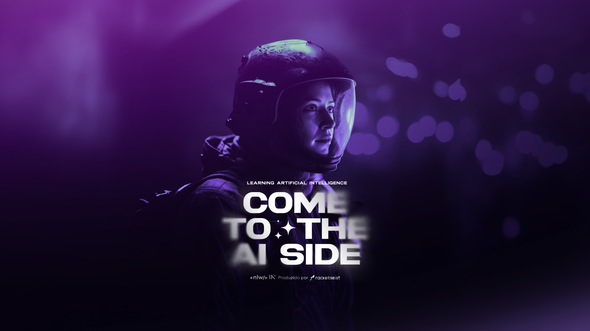

<h1 align="center"> IA Shorts </h1>

Programa exclusivo e gratuito!

  <a href="#-tecnologias">Tecnologias</a>&nbsp;&nbsp;&nbsp;|&nbsp;&nbsp;&nbsp;
  <a href="#-projeto">Projeto</a>&nbsp;&nbsp;&nbsp;|&nbsp;&nbsp;&nbsp;
  <a href="#-layout">Layout</a>&nbsp;&nbsp;&nbsp;|&nbsp;&nbsp;&nbsp;
  <a href="#memo-licença">Licença</a>

  

 

## 🚀 Tecnologias

Esse projeto foi desenvolvido com as seguintes tecnologias:

- HTML e CSS
- JavaScript
- Git e Github
- Figma
- Note.js

## 💻 Projeto

IA Shorts é uma aplicação web para criar resumo de vídeos shorts do Youtube utilizando Inteligência Artificial para transcrever o conteúdo do vídeo e realizar o resumo do conteúdo.

## 🔖 Layout

É necessário ter conta no [Figma](https://figma.com) para acessá-lo.

## :memo: Licença

Esse projeto está sob a licença MIT.

---

Feito com ♥ by EduxCode 
